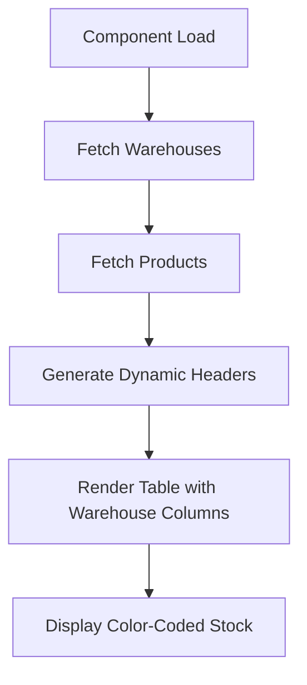

# Implementation Summary: Dynamic Warehouse Stock Table

## 🎯 **Completed Implementation**

### ✅ **Backend Changes**

1. **Product Model Enhanced** (`app/Modules/Management/ProductManagement/Product/Models/Model.php`)
   - Added `warehouse_stock_details` to `$appends` array
   - Created `getWarehouseStockDetailsAttribute()` method
   - Added bulk processing method `getWarehouseStockDataForProducts()`
   - Updated `getTotalStockQuantityAttribute()` for accurate calculation
   - Added DB facade import for raw SQL queries

2. **GetAllData Action Updated** (`app/Modules/Management/ProductManagement/Product/Actions/GetAllData.php`)
   - Enhanced to use bulk warehouse stock processing
   - Optimized for both paginated and non-paginated results
   - Includes warehouse stock details in API response

3. **Model Relationships Added**
   - `WareHouseProductStockProductModel`: Added `wareHouseProductStock()` relationship
   - `WarehouseProductOutProductModel`: Added `wareHouseProductOut()` relationship

### ✅ **Frontend Changes**

1. **Store Enhancements**
   - **Initial State** (`store/initial_state.ts`): Added `warehouses` array
   - **Store Index** (`store/index.ts`): Added `get_warehouses` action
   - **New Action** (`store/async_actions/get_warehouses.ts`): Fetches active warehouses

2. **Component Updates**
   - **TableHead.vue**: Dynamic headers based on warehouse data
   - **TableBody.vue**: Dynamic columns with color-coded stock badges
   - **All.vue**: Fetches warehouses on component creation

3. **Setup Configuration** (`setup/index.ts`)
   - Updated table structure to reflect new dynamic columns

### ✅ **Visual Enhancements**

1. **Color-Coded Stock Badges**
   - 🟢 **Green**: Stock ≥ 10 (Good)
   - 🟡 **Yellow**: Stock < 10 but ≥ 5 (Low)
   - 🔴 **Red**: Stock < 5 (Critical)
   - ⚫ **Gray**: Stock = 0 (Empty)
   - 🔵 **Blue**: Total stock column

2. **Responsive Design**
   - Dynamic column generation
   - Proper spacing and alignment
   - Mobile-friendly badges

## 📊 **Current Table Structure**

| Column | Type | Description |
|--------|------|-------------|
| Actions | Static | Row actions (edit, delete, etc.) |
| Select | Static | Bulk selection checkbox |
| ID | Static | Product sequence number |
| Title | Static | Product name |
| Supplier | Static | Supplier information |
| Category | Static | Product category |
| Sub Category | Static | Product sub-category |
| Total Stock | Static | Sum of all warehouse stocks |
| **[Warehouse] Stock** | **Dynamic** | **Stock for each warehouse** |
| Status | Static | Product status |
| Created At | Static | Creation timestamp |
| Image | Static | Product image |

## 🔄 **Data Flow**



## 🚀 **API Endpoints Used**

1. **Warehouses**: `GET /api/v1/ware-houses?get_all=1&status=active`
2. **Products**: `GET /api/v1/products` (enhanced with warehouse stock details)

## 📝 **Example API Response**

```json
{
  "data": [
    {
      "id": 1,
      "title": "Sample Product",
      "total_stock_quantity": 150,
      "warehouse_stock_details": {
        "total_stock": 150,
        "warehouse_details": [
          {
            "warehouse_id": 1,
            "warehouse_name": "Main Warehouse",
            "stock_in": 200,
            "stock_out": 50,
            "remaining_stock": 150
          },
          {
            "warehouse_id": 2,
            "warehouse_name": "Branch Warehouse",
            "stock_in": 0,
            "stock_out": 0,
            "remaining_stock": 0
          }
        ]
      }
    }
  ]
}
```

## ✅ **Features Delivered**

1. ✅ **Dynamic Warehouse Columns**: Automatically adjusts based on active warehouses
2. ✅ **Color-Coded Stock Display**: Visual indicators for stock levels
3. ✅ **Total Stock Column**: Shows cumulative stock across all warehouses
4. ✅ **Zero Stock Display**: Shows 0 for warehouses with no stock
5. ✅ **Performance Optimized**: Efficient bulk queries
6. ✅ **Responsive Design**: Works on different screen sizes
7. ✅ **Error Handling**: Graceful handling of missing data

## 🧪 **Testing Instructions**

1. **Access the Product List**: Navigate to `/products` in your admin panel
2. **Verify Warehouse Columns**: Check that warehouse names appear as column headers
3. **Check Stock Display**: Verify stock numbers and color coding
4. **Test Zero Stock**: Confirm warehouses with no stock show 0
5. **Verify Total**: Ensure total stock matches sum of warehouse stocks

## 📋 **Files Modified**

### Backend
- `app/Modules/Management/ProductManagement/Product/Models/Model.php`
- `app/Modules/Management/ProductManagement/Product/Actions/GetAllData.php`
- `app/Modules/Management/WarehouseManagement/WareHouseProductStock/Models/WareHouseProductStockProductModel.php`
- `app/Modules/Management/WarehouseManagement/WarehouseProductOut/Models/WarehouseProductOutProductModel.php`

### Frontend
- `resources/js/backend/Views/SuperAdmin/Management/ProductManagement/Product/store/initial_state.ts`
- `resources/js/backend/Views/SuperAdmin/Management/ProductManagement/Product/store/index.ts`
- `resources/js/backend/Views/SuperAdmin/Management/ProductManagement/Product/store/async_actions/get_warehouses.ts` (new)
- `resources/js/backend/Views/SuperAdmin/Management/ProductManagement/Product/components/all_data_page/TableHead.vue`
- `resources/js/backend/Views/SuperAdmin/Management/ProductManagement/Product/components/all_data_page/TableBody.vue`
- `resources/js/backend/Views/SuperAdmin/Management/ProductManagement/Product/pages/All.vue`
- `resources/js/backend/Views/SuperAdmin/Management/ProductManagement/Product/setup/index.ts`

### Documentation
- `WAREHOUSE_STOCK_IMPLEMENTATION.md`
- `API_TESTING_GUIDE.md`
- `DYNAMIC_WAREHOUSE_TABLE.md`

## 🎉 **Ready for Use!**

The implementation is complete and ready for testing. The product table now dynamically displays warehouse-wise stock information with the following benefits:

- **Real-time stock visibility** across all warehouses
- **Visual stock level indicators** with color-coded badges
- **Automatic adaptation** to new/removed warehouses
- **Performance optimized** with efficient database queries
- **User-friendly interface** with clear stock information

You can now access your product list and see the warehouse stock columns in action! 🚀